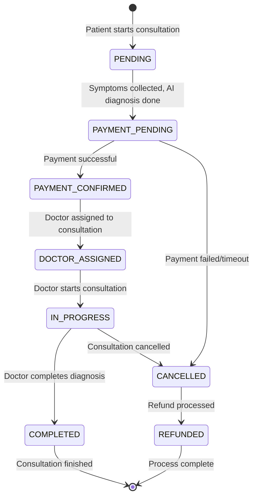
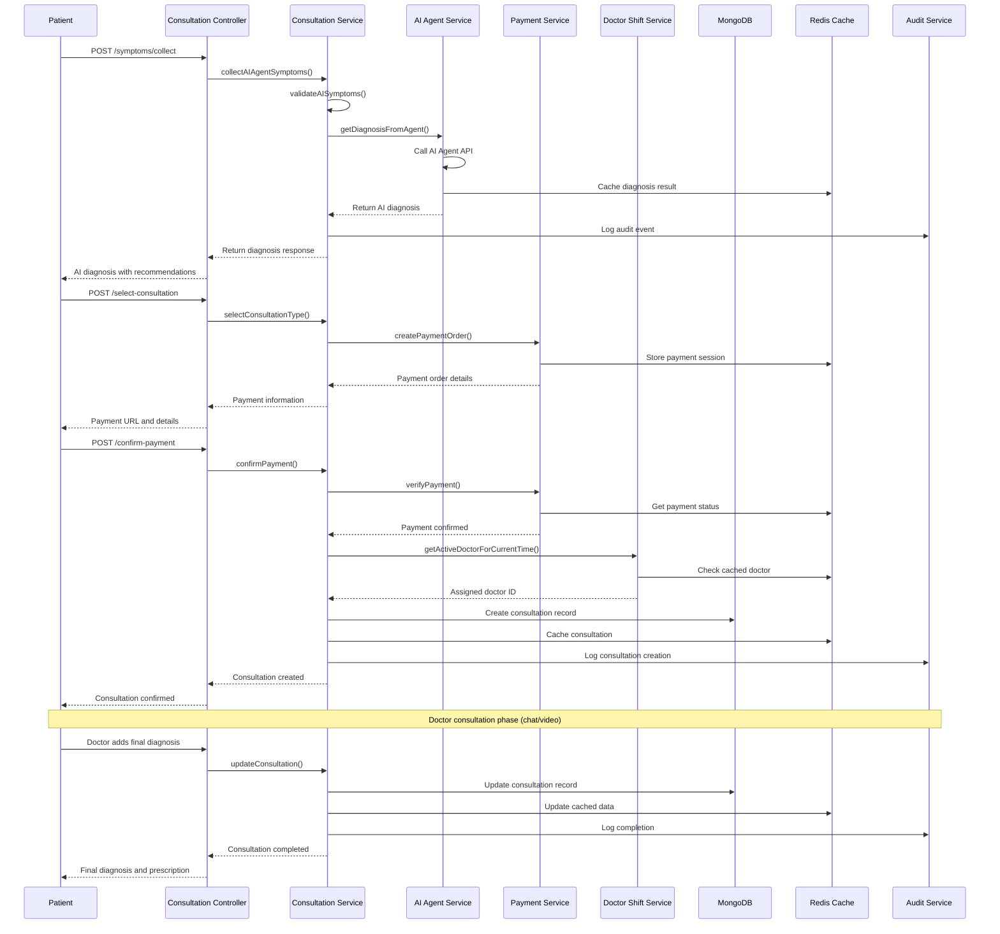
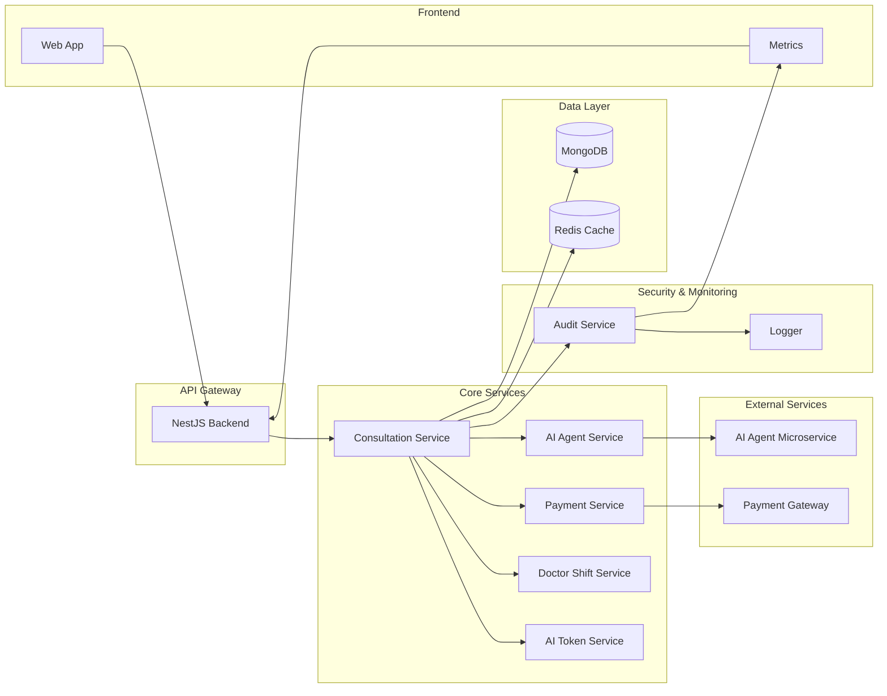

# Consultation Management System - Workflow Diagram

## Visual Data Flow

```mermaid
graph TD
    A[Patient Login] --> B[Symptom Collection Form]
    B --> C[POST /symptoms/collect]
    C --> D{Validate Symptoms}
    D -->|Valid| E[Call AI Agent Service]
    D -->|Invalid| F[Return Validation Error]
    E --> G[AI Diagnosis Response]
    G --> H[Cache Diagnosis Result]
    H --> I[Return AI Diagnosis to Patient]
    
    I --> J[Patient Reviews Diagnosis]
    J --> K[POST /select-consultation]
    K --> L{Select Consultation Type}
    L -->|Chat ₹299| M[Create Payment Order]
    L -->|Video ₹499| M
    L -->|Emergency ₹799| M
    
    M --> N[Mock Payment Gateway]
    N --> O[Payment URL Returned]
    O --> P[Patient Completes Payment]
    P --> Q[POST /confirm-payment]
    
    Q --> R{Verify Payment}
    R -->|Success| S[Create Consultation Record]
    R -->|Failed| T[Payment Failed Response]
    
    S --> U[Assign Doctor Based on Shift]
    U --> V[Update Status: DOCTOR_ASSIGNED]
    V --> W[Cache Consultation Data]
    W --> X[Send Notifications]
    
    X --> Y[Doctor Receives Consultation]
    Y --> Z[Doctor Reviews AI Diagnosis]
    Z --> AA[Start Consultation]
    AA --> BB{Consultation Type}
    
    BB -->|Chat| CC[Text Chat Interface]
    BB -->|Video| DD[Video Call Interface]
    BB -->|Emergency| EE[Priority Queue]
    
    CC --> FF[Doctor-Patient Communication]
    DD --> FF
    EE --> FF
    
    FF --> GG[Doctor Analysis]
    GG --> HH[PATCH /investigations]
    HH --> II[Add Final Diagnosis]
    II --> JJ[Prescribe Medications]
    JJ --> KK[Set Follow-up Requirements]
    KK --> LL[Update Status: COMPLETED]
    
    LL --> MM[Generate Prescription]
    MM --> NN[Send Consultation Summary]
    NN --> OO[Schedule Follow-up if Required]
    OO --> PP[Audit Log Complete]
```

## Database State Changes

## Data Flow Through Services

## System Architecture Overview

## Current Data Storage Structure

### MongoDB Collections

1. **consultations**
   - Primary consultation records
   - Encrypted medical data
   - Status tracking
   - Payment information
   - Chat history

2. **users**
   - Patient and doctor profiles
   - Authentication data
   - Role assignments

3. **doctor-shifts**
   - Doctor availability schedules
   - Shift assignments
   - Status management

4. **audit-logs**
   - User actions
   - Data access logs
   - System events

### Redis Cache Keys

1. **consultation:**
   - `consultation:patient:{patientId}:{limit}:{offset}` - Patient consultations
   - `consultation:id:{consultationId}` - Individual consultation cache

2. **ai-diagnosis:**
   - `ai-diagnosis:{symptomHash}` - Cached AI diagnosis results

3. **doctor-shift:**
   - `doctor-shift:current-doctor:{hour}` - Active doctor lookup

4. **payment:**
   - `payment:session:{sessionId}` - Payment session data

5. **tokens:**
   - `ai-token:current` - AI service JWT token

## Performance Optimization Points

### Current Optimizations
1. **Database Indexes**: Optimized queries for patient, doctor, and status lookups
2. **Redis Caching**: Frequently accessed data cached with appropriate TTLs
3. **AI Diagnosis Caching**: 1-hour cache for repeated symptom patterns
4. **Doctor Assignment Caching**: 30-minute cache for active doctor lookup
5. **Audit Logging**: Asynchronous logging to prevent blocking operations

### Monitoring Metrics
1. **Response Times**: Track API endpoint performance
2. **AI Service Health**: Monitor AI agent connectivity and response times
3. **Cache Hit Rates**: Monitor cache effectiveness
4. **Database Performance**: Query performance and connection pool usage
5. **Payment Success Rates**: Track payment completion rates

This workflow demonstrates how data flows through the system from initial symptom collection to final consultation completion, with proper caching, security, and audit logging at each step.
