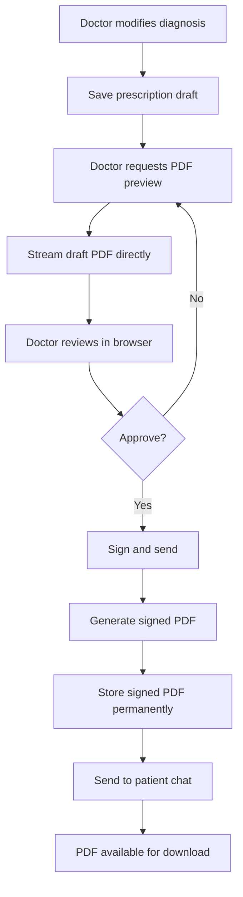

# Hybrid PDF Implementation - Stream Drafts, Store Signed

## Overview

I've implemented the **Option 5 - Hybrid Approach** for your prescription PDF system. This solution provides the best balance of cost-efficiency, compliance, and functionality for your Railway deployment.

## How It Works

### 🔄 **Draft PDFs - Streamed (No Storage)**
- Generated on-demand and streamed directly to client
- No server storage used - perfect for Railway containers
- Instant preview without waiting for file uploads
- Zero storage cost for drafts

### 💾 **Signed PDFs - Stored (Compliance + Chat)**
- Permanently stored in external storage for compliance
- Available for patient chat integration
- Legal record keeping
- Downloadable for patients and doctors

## New API Endpoints

### 1. Stream Draft PDF (NEW)
```http
GET /consultations/{id}/prescription/pdf/preview
Authorization: Bearer {doctor_token}
```
**Response**: Direct PDF stream (no JSON wrapper)
- **Content-Type**: `application/pdf`
- **Content-Disposition**: `inline` (shows in browser)
- **Cache-Control**: `no-cache` (prevents caching drafts)

### 2. Download Signed PDF (NEW)
```http
GET /consultations/{id}/prescription/pdf/download?attachment=true
Authorization: Bearer {doctor_token}
```
**Response**: PDF download from storage
- **Content-Type**: `application/pdf`
- **Content-Disposition**: `attachment` or `inline` based on query param
- **Cache-Control**: `public, max-age=3600` (caches signed PDFs)

## Benefits of This Approach

### ✅ **Cost-Effective for Railway**
- **Zero draft storage**: No PDFs stored on server for drafts
- **Minimal signed storage**: Only final signed PDFs stored
- **No growing storage costs**: Perfect for Railway's pricing model

### ✅ **Compliance Ready**
- **Permanent signed records**: All signed prescriptions stored permanently
- **Audit trail**: Complete history of prescription actions
- **Legal compliance**: Signed PDFs available for regulatory requirements

### ✅ **Patient Chat Integration**
- **Direct URLs**: Signed PDFs have permanent URLs for chat sharing
- **Instant access**: Patients can access signed prescriptions immediately
- **File sharing**: PDFs can be sent directly in chat messages

### ✅ **Performance Benefits**
- **Instant drafts**: No upload delays for preview generation
- **Cached signed PDFs**: Signed documents cached for faster access
- **Reduced server load**: Less I/O operations for drafts

## Updated Workflow



## Frontend Integration

### Draft Preview (Streams directly)
```typescript
// Frontend code example
const previewPdf = async (consultationId: string) => {
  const response = await fetch(
    `/consultations/${consultationId}/prescription/pdf/preview`,
    {
      headers: { Authorization: `Bearer ${token}` }
    }
  );
  
  if (response.ok) {
    const blob = await response.blob();
    const url = URL.createObjectURL(blob);
    // Show in new tab/window for preview
    window.open(url, '_blank');
  }
};
```

### Signed PDF Download
```typescript
// Frontend code example
const downloadSignedPdf = async (consultationId: string) => {
  const response = await fetch(
    `/consultations/${consultationId}/prescription/pdf/download?attachment=true`,
    {
      headers: { Authorization: `Bearer ${token}` }
    }
  );
  
  if (response.ok) {
    const blob = await response.blob();
    const url = URL.createObjectURL(blob);
    const a = document.createElement('a');
    a.href = url;
    a.download = `prescription-${consultationId}.pdf`;
    a.click();
  }
};
```

## Storage Configuration

### Development (Current)
- Uses local file system for signed PDFs
- Draft PDFs never touch disk

### Production (Ready for upgrade)
- Switch to AWS S3 for signed PDF storage
- Update `FileStorageService.useLocalStorage = false`
- Configure AWS credentials and bucket names

## Migration Impact

### ✅ **Backward Compatibility**
- Existing `generatePreview()` method still works
- All existing endpoints remain functional
- No breaking changes to current workflow

### ✅ **Gradual Migration**
- Can switch to new streaming endpoints incrementally
- Old and new approaches work side-by-side
- Easy rollback if needed

## Production Deployment Benefits

### 🚀 **Railway Optimized**
- **No growing storage**: Server storage stays constant
- **Better performance**: Faster container startup
- **Cost predictable**: No surprise storage charges

### 🔒 **Security & Compliance**
- **Signed PDF integrity**: Hash verification for signed documents
- **Audit trails**: Complete prescription history tracking
- **Access control**: Proper authentication on all endpoints

### 📱 **Patient Experience**
- **Instant previews**: Doctors get immediate PDF preview
- **Chat integration**: Signed prescriptions shared directly in chat
- **Download flexibility**: Patients can download or view inline

## Next Steps

1. **Test the new endpoints** with your frontend
2. **Update frontend code** to use streaming for drafts
3. **Configure external storage** (AWS S3) for production
4. **Update patient chat** to use signed PDF URLs
5. **Monitor storage usage** - should see significant reduction

## Technical Details

### Error Handling
- Comprehensive error handling for missing files
- Graceful fallbacks for storage issues
- Detailed logging for debugging

### Caching Strategy
- **Drafts**: No caching (always fresh)
- **Signed PDFs**: 1-hour cache (performance optimization)

### File Naming Convention
- **Drafts**: Not stored (generated on-demand)
- **Signed**: `prescription-signed-{consultationId}.pdf`

This implementation gives you the best of both worlds: cost-effective draft handling and compliant signed document storage, perfectly suited for your Railway deployment and patient chat requirements.
